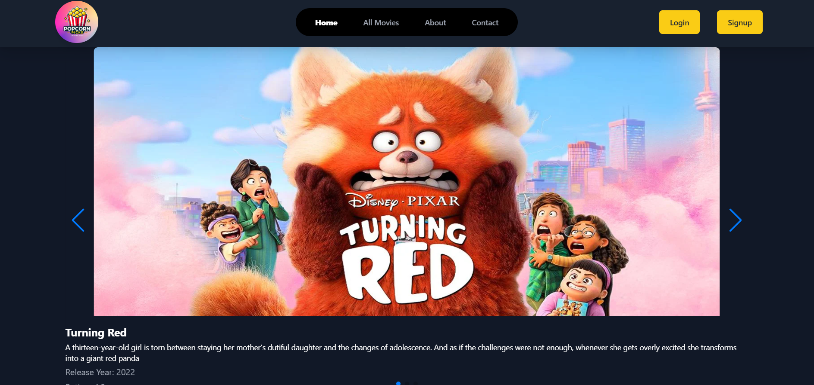
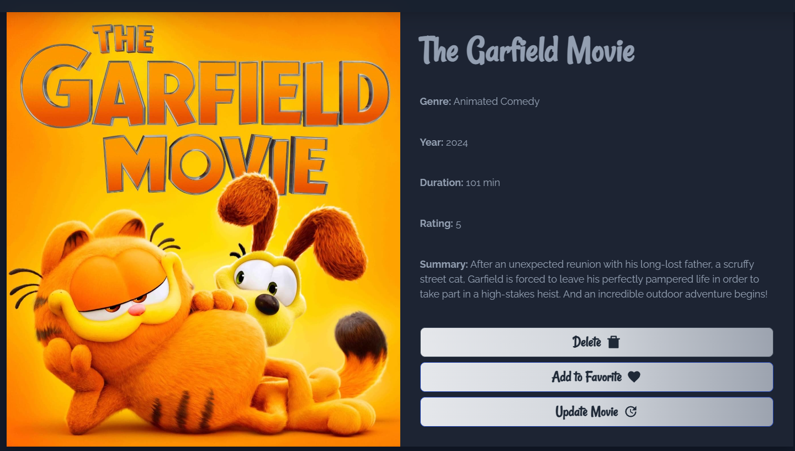
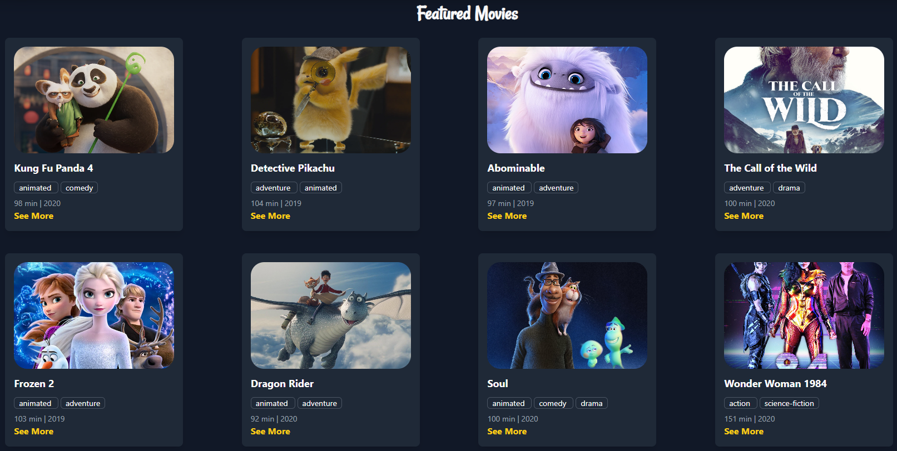

# 🍿 Popcorn Picks

## Project Purpose

**Popcorn Picks** is a movie portal website that displays movies based on user ratings. Each movie card is designed with hover effects and animations, allowing users to quickly view essential details such as title, rating, and release date.

Users can:
- 🔍 Search movies by title
- 📈 Explore the **Trending Movies** section with dynamically updated data
- 📝 View detailed pages with synopsis and ratings
- ❤️ Add favorite movies to a personalized watchlist

## Preview

## Live Demo 

👉 [View the Live Site](https://popcorn-picks-movies-portal.web.app/)

## Server-Side Code

You can find the server-side code here:  
👉 [Popcorn Picks Server Repository](https://github.com/Rain44556/Popcorn-Picks-Server)

## Features

- ✅ **Top 6 Highest-Rated Movies** section
- 🎬 **Interactive Movie Cards** with hover animations
- 🔍 **Search and Filter Functionality**
- 📈 **Trending Movies Section** with dynamic content
- 📄 **Detailed Movie Information** on separate pages
- ❤️ **Favorites (Watchlist)** feature to save preferred movies

## Tech Stack

- **Frontend:** React.js, Tailwind CSS, DaisyUI
- **Backend:** Express.js, MongoDB, Node.js
- **Authentication and Hosting:** Firebase and Vercel
- **Styling Utilities:** React Icons, SweetAlert2, Swiper.js, React Toastify, React Simple Star Rating

## NPM Packages Used

### Client-Side:
- `react-router-dom`  
- `react-icons`  
- `react-toastify`  
- `sweetalert2`  
- `swiper`  
- `react-simple-star-rating`  
- `tailwindcss`  
- `daisyui`

### Server-Side:
- `mongodb`  
- `cors`  
- `dotenv`  
- `express`  
